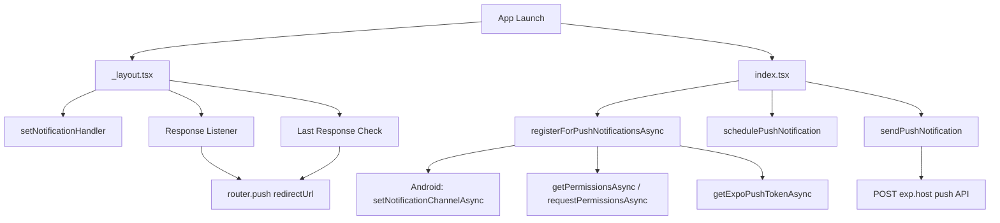

# Expo Notification Sandbox

[English](README.md) | [日本語](README.ja.md)

このプロジェクトは、Expo、expo-router、expo-notifications を使ったプッシュ通知のサンドボックスアプリです。ローカル通知とリモート通知の両方を確認できます。

## ✨ 機能概要

| 機能                              | 説明                                                             |
| --------------------------------- | ---------------------------------------------------------------- |
| **ローカル通知**                  | `schedulePushNotification` で 2 秒後にローカル通知をスケジュール |
| **リモート通知（Expo Push API）** | `sendPushNotification` で Expo Push API 経由でプッシュ通知を送信 |
| **ディープリンク**                | 通知タップ時に指定した画面へ遷移                                 |
| **通知チャンネル（Android）**     | Android でデフォルトの通知チャンネルを作成                       |
| **権限管理**                      | 通知権限の取得・確認を自動で行う                                 |

## 🏗️ アーキテクチャ



## 📁 通知関連のファイル構成

```
src/
├── app/
│   ├── _layout.tsx              # 通知ハンドラ、応答リスナー、ディープリンク処理
│   ├── index.tsx                # 通知登録・スケジュール・送信の UI
│   └── redirect-success.tsx    # ディープリンク遷移先画面
└── utils/
    ├── registerForPushNotificationsAsync.ts  # 権限取得・チャンネル作成・トークン取得
    ├── schedulePushNotification.ts           # ローカル通知のスケジュール
    ├── sendPushNotification.ts               # Expo Push API でリモート通知を送信
    └── handleRegistrationError.ts            # 登録失敗時にアラート表示
```

## 🚀 セットアップ手順

### 1. EAS プロジェクトを初期化する

既存の `projectId` がある場合は、`eas init` 前に削除しておきます。

```diff
  extra: {
    ...config.extra,
    router: {},
    eas: {
-       projectId: 'a87e19b2-b67f-4950-bb78-950de030f659',
    },
  },
```

`eas-cli` がまだ入っていなければインストールします。

```bash
# bun add -g eas-cli
# npm install -g eas-cli
# yarn global add eas-cli

# EAS にログイン
eas login
```

```bash
eas init
```

### 2. 依存関係をインストールする

```bash
bun install
```

Bun を使っていない場合は `bun.lock` を削除して `npm install` または `yarn install` を実行します。

### 3. ネイティブコードを生成する

```bash
bunx expo prebuild

# 2 回目以降
bunx expo prebuild --clean
```

### 4. クレデンシャルを設定する

#### iOS

```bash
eas build:configure
```

Apple Developer アカウントが必要です。初回時は次のように答えます。

```
Reuse this distribution certificate? → Y
Generate a new Apple Provisioning Profile? → Y
```

#### Android

Android では Firebase と Expo 管理画面の設定が必要です。

**Firebase 側:**

1. Firebase Console でプロジェクトを作成する
2. 各環境向けに Android アプリを登録する
3. `google-services.json` をダウンロードしてプロジェクトルートに置く
4. SHA-1 fingerprint を Expo 管理画面に登録する

**Firebase の秘密鍵を生成:**

1. Firebase Console のプロジェクト設定 → サービスアカウントへ進む
2. **新しい秘密鍵を生成** をクリックする
3. ダウンロードした JSON を保存する

**Expo 側:**

```bash
eas credentials
```

1. **Android** を選択
2. 環境を選択する
3. **Google Service Account** を選択
4. 最初の環境では **Set up a Google Service Account Key for Push Notifications (FCM V1)** を選び、以降の環境では **Select an existing ...** を選ぶ
5. JSON ファイルのパスを指定する

### 5. Firebase で Android アプリを登録する

`app.config.ts` の `VARIANT_CONFIGS` に定義された各 bundle identifier を Firebase に登録します。

| 環境          | bundle identifier                       |
| ------------- | --------------------------------------- |
| `development` | `com.expo.notification.sandbox.dev`     |
| `preview`     | `com.expo.notification.sandbox.preview` |
| `production`  | `com.expo.notification.sandbox`         |

1. Firebase Console を開く
2. **アプリに追加 → Android** をクリックする
3. パッケージ名を入力して登録する
4. `google-services.json` をダウンロードしてプロジェクトルートに置く

### 6. ローカルビルドする

```bash
# Development build
eas build --local --platform ios --profile development
eas build --local --platform android --profile development

# Preview build
eas build --local --platform ios --profile preview
eas build --local --platform android --profile preview

# Production build
eas build --local --platform ios --profile production
eas build --local --platform android --profile production
```

> iOS と Android を同時にビルドすることはできません。`--platform` を明示してください。

### 7. デバイスにインストールする

**Android:**

```bash
adb devices
adb -s <deviceId> install <.apk path>
```

**iOS:**

```bash
xcrun devicectl list devices
xcrun devicectl device install app --device <identifier> <.ipa path>
```

### 8. SHA-1 を登録する

EAS ビルドが完了すると、Expo Dashboard から各 identifier ごとの SHA-1 を確認できます。

1. Expo Dashboard を開く
2. **Settings → Credentials** を開く
3. 各 identifier の SHA-1 を確認する
4. Firebase Console の Android アプリ設定に追加する

### 9. アプリを起動する

```bash
bun run start --dev-client
```

## 🔗 参考リンク

- [Expo push notifications setup](https://docs.expo.dev/push-notifications/push-notifications-setup/)
- [Send notifications with the Expo Push Service](https://docs.expo.dev/push-notifications/sending-notifications/)
- [Send notifications with FCM and APNs](https://docs.expo.dev/push-notifications/sending-notifications-custom/)
- [Expo Notifications with EAS | Complete Guide](https://www.youtube.com/watch?v=BCCjGtKtBjE)
