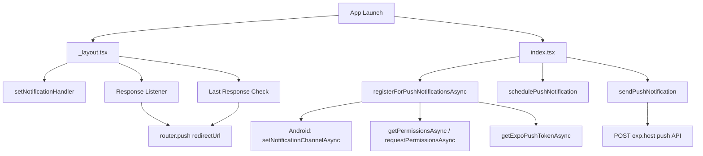

# Expo Notification Sandbox

[English](README.md) | [日本語](README.ja.md)

This project is a sandbox app for push notifications using Expo, expo-router, and expo-notifications. It demonstrates both local notifications and remote notifications.

## ✨ Features

| Feature                                  | Description                                                                     |
| ---------------------------------------- | ------------------------------------------------------------------------------- |
| **Local notifications**                  | Schedule a local notification after 2 seconds using `schedulePushNotification`  |
| **Remote notifications (Expo Push API)** | Send a push notification through the Expo Push API using `sendPushNotification` |
| **Deep links**                           | Navigate to a specific route when the notification is tapped                    |
| **Notification channels (Android)**      | Create a default notification channel on Android                                |
| **Permission handling**                  | Request and verify notification permissions automatically                       |

## 🏗️ Architecture



## 📁 Notification-related file structure

```
src/
├── app/
│   ├── _layout.tsx              # Notification handler, response listener, and deep-link handling
│   ├── index.tsx                # Home screen for registration, scheduling, and sending notifications
│   └── redirect-success.tsx    # Destination screen for deep-link navigation
└── utils/
    ├── registerForPushNotificationsAsync.ts  # Request permission, create channel, and get token
    ├── schedulePushNotification.ts           # Schedule a local notification
    ├── sendPushNotification.ts               # Send a remote notification via Expo Push API
    └── handleRegistrationError.ts            # Show an alert and throw on registration failure
```

## 📄 File details

### `_layout.tsx` — notification handler and deep links

- `Notifications.setNotificationHandler` defines how notifications are displayed while the app is in the foreground.
- `addNotificationResponseReceivedListener` handles redirects when the user taps a notification.
- `getLastNotificationResponse` handles launch-from-notification flows when the app is opened from a background or terminated state.
- The `redirectUrl` stored in `data.url` is navigated with `router.push`.

### `index.tsx` — home screen

The screen provides three buttons:

| Button                                  | Action                                                                  |
| --------------------------------------- | ----------------------------------------------------------------------- |
| **Press to schedule a notification**    | Schedules a local notification after 2 seconds                          |
| **Press to Send Notification**          | Sends a remote notification through the Expo Push API                   |
| **Press to Send Redirect Notification** | Sends a notification with a redirect URL that opens `/redirect-success` |

On mount, `useEffect` runs registration automatically and displays the Expo push token.

### `registerForPushNotificationsAsync.ts` — notification registration

1. Create the default Android notification channel.
2. Request notification permissions if needed.
3. Retrieve the project ID from `app.config.ts` and get the Expo push token.
4. Show an error alert and throw if registration fails.

### `schedulePushNotification.ts` — local notifications

Uses `Notifications.scheduleNotificationAsync` with a `TIME_INTERVAL` trigger of 2 seconds.

### `sendPushNotification.ts` — remote notifications

Sends a request to `POST https://exp.host/--/api/v2/push/send` with the Expo push token and payload.

- `title` and `body` can be overridden.
- `redirectUrl` is stored in `data.url` and used for redirect behavior.
- UI status updates are sent through the `onStatusUpdate` callback.

### `handleRegistrationError.ts` — error handling

Displays an alert with the error message and throws an `Error` to stop execution.

## ⚙️ Configuration

### `app.config.ts`

- `extra.eas.projectId` — EAS project ID used for push services
- `expo-notifications` is included in the `plugins` list
- iOS: `ITSAppUsesNonExemptEncryption: false`
- Android: `googleServicesFile` points to the Firebase config file

### `eas.json`

| Profile       | Description                                         |
| ------------- | --------------------------------------------------- |
| `development` | Development client build with internal distribution |
| `preview`     | Internal distribution                               |
| `production`  | Auto increment enabled                              |

## 🚀 Setup steps

### 1. Initialize the EAS project

If an existing `projectId` is present, remove it before running `eas init`.

```diff
  extra: {
    ...config.extra,
    router: {},
    eas: {
-       projectId: 'a87e19b2-b67f-4950-bb78-950de030f659',
    },
  },
```

Install `eas-cli` if it is not already installed.

```bash
# bun add -g eas-cli
# npm install -g eas-cli
# yarn global add eas-cli

# Log in to EAS
eas login
```

Initialize the project.

```bash
eas init
```

### 2. Install dependencies

```bash
bun install
```

If you do not use Bun, remove `bun.lock` and run `npm install` or `yarn install` instead.

### 3. Generate native code with prebuild

```bash
bunx expo prebuild

# On subsequent runs
bunx expo prebuild --clean
```

### 4. Configure credentials

#### iOS

```bash
eas build:configure
```

You need an Apple Developer account. When prompted, answer:

```
Reuse this distribution certificate? → Y
Generate a new Apple Provisioning Profile? → Y
```

#### Android

Android requires Firebase and Expo dashboard configuration.

**Firebase side:**

1. Create a project in Firebase Console or select an existing one.
2. Add an Android app for each variant (`com.expo.notification.sandbox.dev`, `com.expo.notification.sandbox.preview`, `com.expo.notification.sandbox`).
3. Download the `google-services.json` file and place it at the project root.
4. Register the SHA-1 fingerprint in Expo Dashboard.

**Generate a Firebase service account key:**

1. Open Firebase Console → Project settings → Service accounts.
2. Click **Generate new private key**.
3. Save the downloaded JSON file securely.

**Expo side:**

Run `eas credentials` and register the service account key for Android.

```bash
eas credentials
```

1. Select **Android**.
2. Choose the environment (`development`, `preview`, or `production`).
3. Select **Google Service Account**.
4. Choose **Set up a Google Service Account Key for Push Notifications (FCM V1)** for the first environment, or **Select an existing Google Service Account Key** for the next ones.
5. Provide the path to the downloaded JSON file.

### 5. Register Android apps in Firebase

Register one Android app in Firebase for each bundle identifier defined in `app.config.ts`.

| Environment   | bundle identifier                       |
| ------------- | --------------------------------------- |
| `development` | `com.expo.notification.sandbox.dev`     |
| `preview`     | `com.expo.notification.sandbox.preview` |
| `production`  | `com.expo.notification.sandbox`         |

**Steps:**

1. Open Firebase Console.
2. Click **Add app → Android**.
3. Enter the package name for each environment.
4. Download the `google-services.json` file for the app.
5. Place the file at the project root.

> Note: You may need to swap the `google-services.json` file depending on the environment you are building.

### 6. Build locally

```bash
# Development build
eas build --local --platform ios --profile development
eas build --local --platform android --profile development

# Preview build
eas build --local --platform ios --profile preview
eas build --local --platform android --profile preview

# Production build
eas build --local --platform ios --profile production
eas build --local --platform android --profile production
```

> Note: You cannot build iOS and Android at the same time. You must specify `--platform`.

If fastlane is not installed for iOS builds, install it first:

```bash
# Install fastlane
# brew install fastlane
# fastlane -v
```

### 7. Install on a device

After the build finishes, install the generated `.apk` or `.ipa` file.

**Android (adb):**

```bash
adb devices
adb -s <deviceId> install <.apk path>
```

**iOS (devicectl):**

```bash
xcrun devicectl list devices
xcrun devicectl device install app --device <identifier> <.ipa path>
```

### 8. Register SHA-1 fingerprints

After the EAS build completes, Expo Dashboard exposes SHA-1 fingerprints per identifier.

**Get them from Expo Dashboard:**

1. Open Expo Dashboard.
2. Go to **Settings → Credentials**.
3. Check the SHA-1 fingerprint for each identifier (`development`, `preview`, `production`).

**Register them in Firebase:**

1. Open Firebase Console.
2. Go to **Project settings → Your apps**.
3. Select the Android app.
4. Add the SHA-1 fingerprint to the **SHA-1 fingerprint** field.

> Note: Each build profile can generate a different SHA-1 fingerprint, so you should register all of them.

### 9. Launch the app

```bash
# For development builds
bun run start --dev-client
```

> Preview builds can usually run without starting a local server.

## 🔗 References

- [Expo push notifications setup](https://docs.expo.dev/push-notifications/push-notifications-setup/)
- [Send notifications with the Expo Push Service](https://docs.expo.dev/push-notifications/sending-notifications/)
- [Send notifications with FCM and APNs](https://docs.expo.dev/push-notifications/sending-notifications-custom/)
- [Expo Notifications with EAS | Complete Guide](https://www.youtube.com/watch?v=BCCjGtKtBjE)
